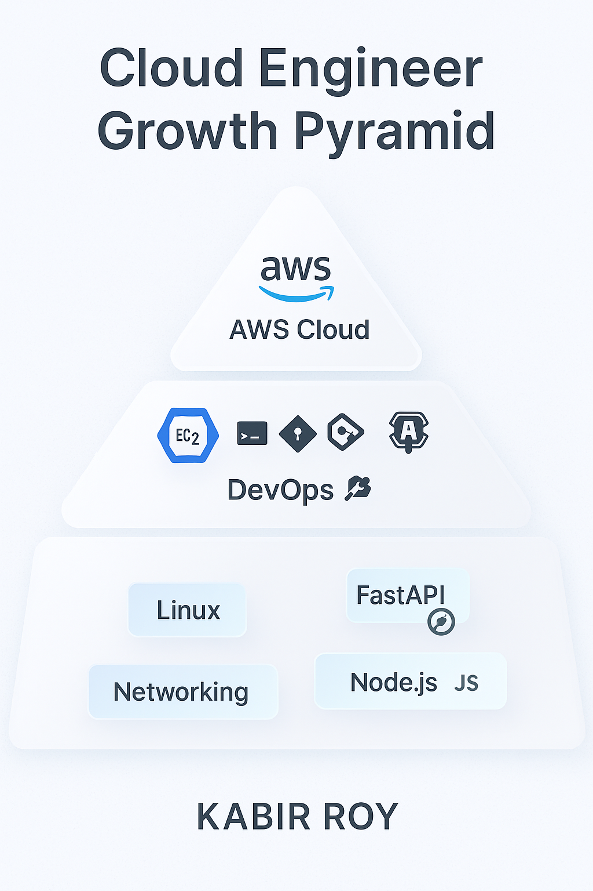

<!-- ================== KABIR ROY | CLOUD + DEVOPS MASTERING ENGINEER ================== -->

<!-- Futuristic Neon Banner -->
<p align="center">
  
</p>

<p align="center">
  
</p>

---

## 💻 Terminal — Who Am I?
```bash
> DevOps_Engineer --whoami
▶ Kabir Roy
▶ Cloud ☁️ | DevOps ⚙️ | Backend 💻
▶ I deploy ideas into scalable systems 🚀
```
🔥 Live DevOps Automation
<p align="center"> <!-- CI/CD →  <!-- AWS Badge -->  <!-- Contribution Badge -->  </p>

🤖 Everything updates automatically via GitHub Actions

🌩️ Skills Evolution — Cloud Engineer Journey
<p align="center">  </p> <p align="center"><i>Continuous growth in Cloud & DevOps 🔁</i></p>
🧰 Cloud & DevOps Toolbox
<p align="center">  </p>
🚀 Featured Project
<div align="center">
🎯 Resume-SaaS

“How well does your resume match the job?”

 

📌 Semantic Scoring Engine (Resume ↔ Job Description)
⚙️ Backend: FastAPI + Modular Architecture
🐳 Docker Deployment Coming
🔐 Auth & RBAC Next

🔗 https://github.com/Kabirroy12345/resume-saas

</div>
⚙️ Tech Areas & Skills
Domain	Tools & Tech
Cloud ☁️	AWS EC2, IAM, VPC, S3, CloudWatch
DevOps 🔁	Docker, GitHub Actions, Monitoring
Backend 💻	FastAPI, Node.js
Systems 🐧	Linux Internals, Networking Basics
📊 Engineering Consistency
<div align="center">   </div> <p align="center">  </p>

Persistence >>> Motivation 🧠

🔥 Currently Leveling Up In
Skill	Status
AWS Cloud Practitioner	loading… ⏳
AWS Solution Architect Associate	upcoming 📘
Docker + CI/CD pipelines	active 🚀
Monitoring & Observability	active ⚙️
🌍 Let's Connect & Build Together
<p align="center"> <a href="mailto:kabirroy0032@gmail.com"></a> <a href="https://linkedin.com/in/kabir-roy-01474527a"></a> <a href="https://github.com/Kabirroy12345"></a> </p>
<p align="center">  </p> ```
✨ Result

Your profile now looks like:

✔ A cloud-native DevOps engineer
✔ Someone who deploys real systems
✔ A future AWS-certified professional
✔ Not a student — a serious builder ⚡
